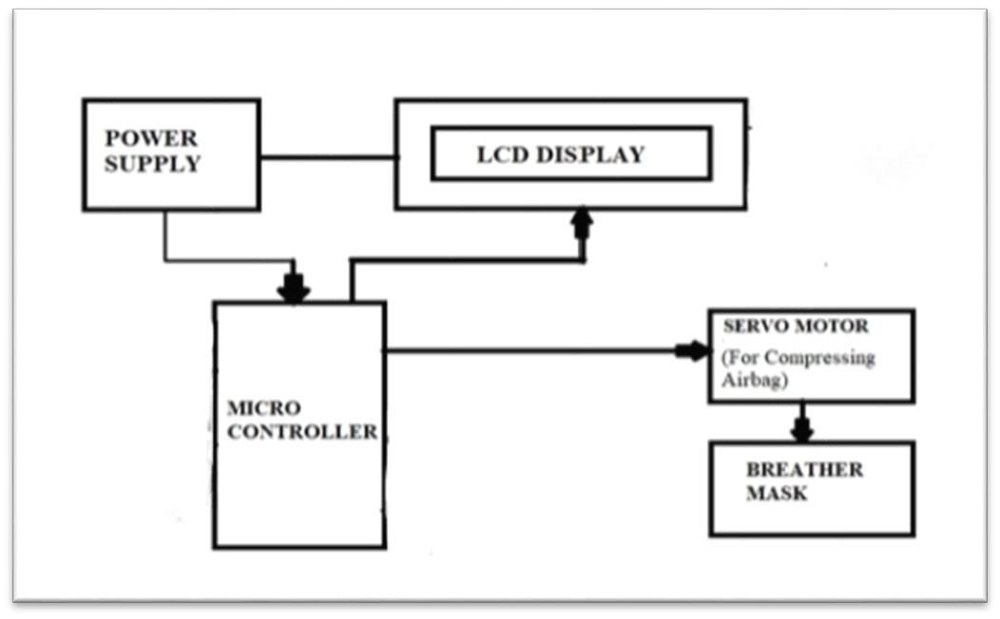
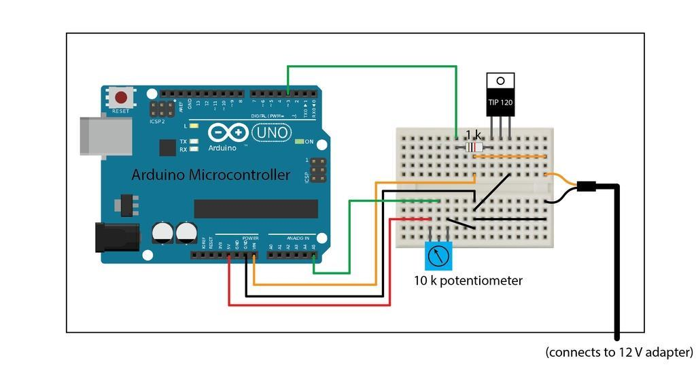
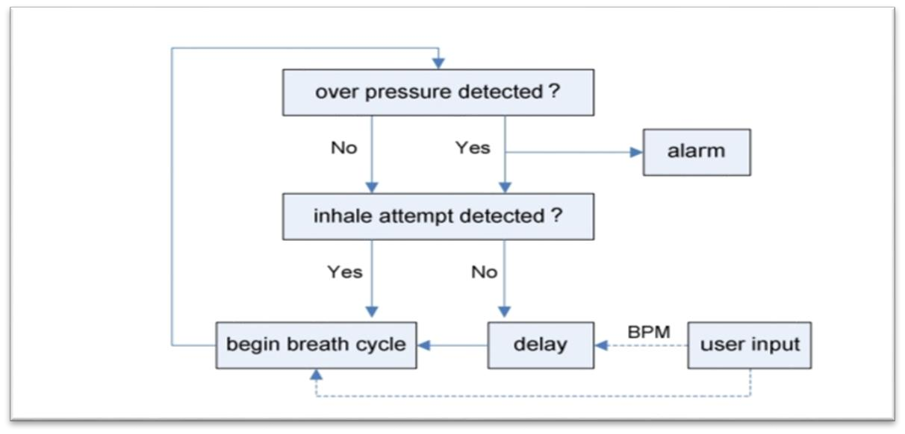
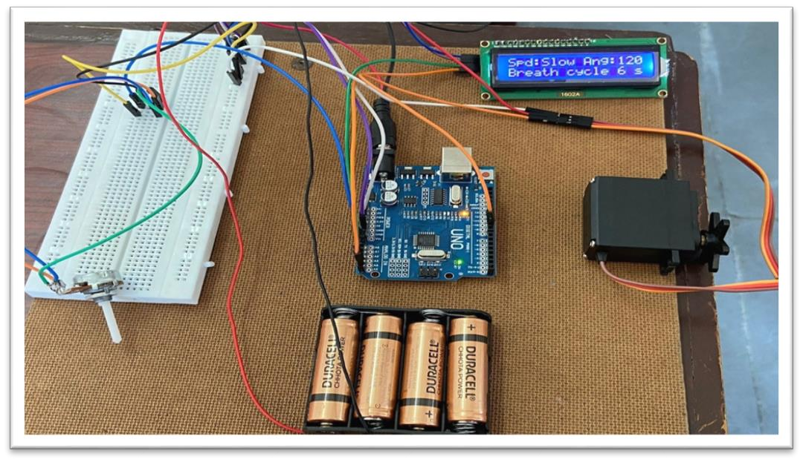

# Portable Ventilator Using Arduino

An embedded-systems prototype for automating the compression of a BVM/Ambu bag using an Arduino UNO and a high-torque servo motor.

> **Project Status:** Engineering Prototype
> This repository documents the design, embedded programming, hardware integration, prototype development, and reported project results. It is not presented as a clinically validated medical device.

---

## 📌 Overview

This project presents the design and development of a **portable automated ventilator prototype** based on an **Arduino UNO** and a **high-torque servo motor**.

The system is designed to automate the mechanical compression of a **BVM/Ambu bag**. The Arduino-based control system manages the servo motor movement, while a potentiometer is used for user input and a 16×2 LCD with I2C interface provides display information.

The project combines embedded programming, actuator control, user-input interfacing, display interfacing, and portable power implementation into a single hardware prototype.

---

## 🎯 Objectives

The main objectives of the project were:

* To develop a portable automated mechanism for BVM/Ambu bag compression.
* To control the mechanical actuation using an Arduino UNO.
* To interface a high-torque servo motor with the microcontroller.
* To use a potentiometer for user input and control.
* To provide information through a 16×2 LCD with I2C interface.
* To implement rechargeable battery-based operation.
* To integrate the electronic and mechanical components into a working prototype.

---

## 🛠️ Hardware & Software

| Category                | Component / Technology                  |
| ----------------------- | --------------------------------------- |
| Microcontroller         | Arduino UNO (ATmega328P)                |
| Actuator                | High-Torque Servo Motor                 |
| User Input              | Potentiometer                           |
| Display                 | 16×2 LCD with I2C                       |
| Power Supply            | 18650 Li-ion Battery with Type-C Module |
| Programming Environment | Arduino IDE                             |
| Programming             | Embedded C / Arduino                    |
| Mechanical Element      | BVM / Ambu Bag                          |

---

## ⚙️ System Architecture

The overall system architecture is represented in the block diagram below.

The Arduino UNO forms the main control unit. User input is provided through the potentiometer, and the programmed control logic determines the servo motor movement. The servo motor provides the mechanical actuation required for BVM/Ambu bag compression.

The LCD is used to display the relevant operating information during operation.

### Block Diagram



---

## 🔄 Working Principle

The prototype operates through the following general sequence:

1. The Arduino UNO initializes the connected peripherals.
2. The potentiometer provides an analog input to the Arduino.
3. The input is processed by the embedded program.
4. The servo motor is controlled according to the programmed logic.
5. The servo movement provides the mechanical compression of the BVM/Ambu bag.
6. The LCD displays the programmed operating information.
7. The control sequence continues during operation.

The source code for the embedded control is provided in `main.ino`.

---

## 📊 Reported Project Results

The developed prototype demonstrated the following reported results:

* **12 breaths per minute** under the reported operating condition.
* Approximately **2 seconds clockwise and 3 seconds anti-clockwise** servo movement for the reported condition.
* A reported breathing-cycle range of approximately **3.5–6 seconds**.
* Approximately **3.5 hours of battery operation** under the reported most-demanding condition.
* Successful development of a **portable working prototype** integrating the electronic control and mechanical actuation system.

These values represent the project conditions and results documented for the developed prototype. The different parameter combinations present in the source code are **not presented as individually tested experimental results**.

---

## 🔧 Engineering Contribution

This project involved the integration of:

* Arduino-based embedded control
* Analog potentiometer interfacing
* Servo motor control
* LCD interfacing using I2C
* Embedded programming
* Rechargeable battery-based power implementation
* Mechanical integration of the servo motor and BVM/Ambu bag
* Hardware prototype development

The project provided practical experience in integrating embedded software with electronic and mechanical components to develop a functional prototype.

---

## 🖼️ Project Documentation

### Circuit Diagram



The circuit diagram documents the electrical connections used in the prototype.

### Flow Chart



The flow chart represents the control sequence used in the project.

### Developed Prototype



The image shows the developed physical prototype.

---

## 🎥 Demonstration

A demonstration video of the developed prototype is included in the repository:

`PortableVentilator.mp4`

---

## 📄 Project Report

The detailed project documentation is available in:

`ProjectReport.pdf`

---

## 💻 Source Code

The Arduino implementation is provided in:

`main.ino`

The source code contains the embedded control logic for the prototype, including potentiometer input, servo motor control, LCD interfacing, and serial communication.

---

## ⚠️ Limitations

This project represents an **engineering prototype** developed for embedded-system and hardware-prototyping purposes.

The results documented in this repository should be interpreted as prototype-level project results. The system is **not presented as a clinically validated medical device**, and this repository does not make claims regarding clinical effectiveness or patient use.

---

## 🔬 Technical & Research Relevance

This project provided hands-on experience in:

* Embedded Systems
* Microcontroller-Based Control
* Actuator Interfacing
* Analog Input Interfacing
* LCD and I2C Communication
* Hardware–Software Integration
* Embedded Programming
* Portable System Development

The project contributes to my broader technical interests in **Embedded Systems, IoT, Real-Time Systems, Edge AI, Communication Systems, and Hardware–Software Co-Design**.

---

## 📂 Repository Structure

```text
Portable-Ventilator/
│
├── Images/
│   ├── Block_diagram.png
│   ├── Circuit_diagram.png
│   ├── Designed_developed_prototype.png
│   └── Flow_Chart.png
│
├── PortableVentilator.mp4
├── ProjectReport.pdf
├── README.md
└── main.ino
```

---

## 👩‍💻 Author

**Khatija Mahveen**

M.E. Embedded Systems | Electronics & Communication Engineering

Research Interests:

**Embedded Systems • Edge AI • IoT • Real-Time Systems • Communication Systems • Hardware–Software Co-Design**

---

## 📌 Project Summary

**Portable Ventilator Using Arduino** is an embedded-system prototype demonstrating the integration of microcontroller programming, servo motor control, potentiometer interfacing, LCD communication, rechargeable battery operation, and mechanical actuation for automated BVM/Ambu bag compression.
